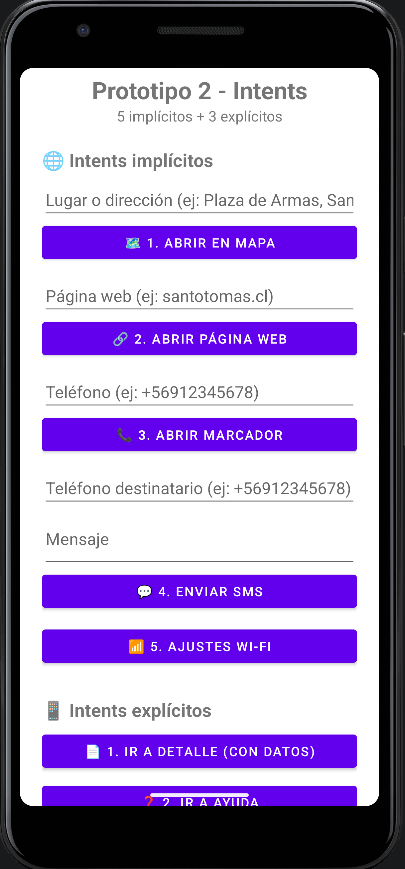
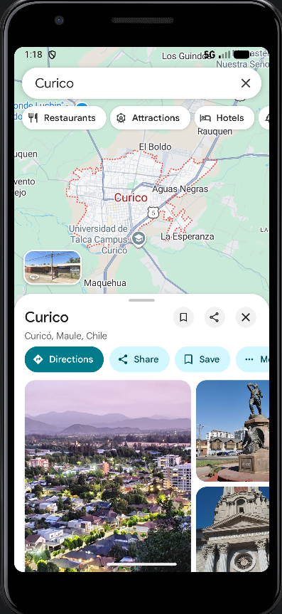
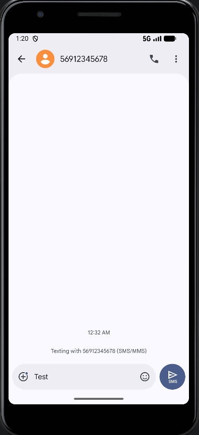
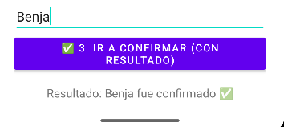

# 📱 Prototipo 2 - Intents Implícitos y Explícitos

Aplicación Android básica en **Java** que implementa **8 intents**: 5 implícitos y 3 explícitos, con validaciones en cada funcionalidad.

> 🎓 Programación Android · Santo Tomás · Proyecto Prototipo 2
> 👥 Integrante: _ Benjamin Muñoz Vergara _

---

## ⚙️ Versiones

| Elemento | Versión |
|---|---|
| Lenguaje | Java 11 |
| Android Gradle Plugin (AGP) | 9.0.1 |
| compileSdk / targetSdk | 36 |
| minSdk | 31 (Android 12) |
| Paquete | `com.devst.prototipo2` |

---

## 🌐 Intents implícitos (5)

| # | Función | Intent / Acción | Validación |
|---|---|---|---|
| 1 | 🗺️ Abrir lugar en mapa | `ACTION_VIEW` + `geo:0,0?q=lugar` | Campo no vacío |
| 2 | 🔗 Abrir página web | `ACTION_VIEW` + `https://` | No vacío + formato de URL válido |
| 3 | 📞 Abrir marcador | `ACTION_DIAL` + `tel:` | No vacío + formato de teléfono |
| 4 | 💬 Enviar SMS (interfaz del sistema) | `ACTION_SENDTO` + `smsto:` | Teléfono válido + mensaje no vacío |
| 5 | 📶 Ajustes Wi-Fi | `Settings.ACTION_WIFI_SETTINGS` | Captura `ActivityNotFoundException` |

### 🧪 Pasos de prueba
1. **Mapa:** escribir `Plaza de Armas, Santiago` → botón *Abrir en mapa* → se abre Google Maps.
2. **Web:** escribir `santotomas.cl` → botón *Abrir página web* → se abre el navegador.
3. **Marcador:** escribir `+56912345678` → botón *Abrir marcador* → aparece el número en el teclado de llamadas (no llama solo).
4. **SMS:** escribir un teléfono y un mensaje → botón *Enviar SMS* → se abre la app de mensajes con el número y el texto prellenados (no se envía automáticamente).
5. **Wi-Fi:** botón *Ajustes Wi-Fi* → se abre la configuración del sistema.
6. **Validación:** dejar un campo vacío y presionar su botón → aparece el error en rojo en el campo.

---

## 📱 Intents explícitos (3)

| # | Navegación | Detalle |
|---|---|---|
| 1 | `MainActivity → DetalleActivity` | Envía datos con `putExtra` (título, descripción, precio) |
| 2 | `MainActivity → AyudaActivity` | Pantalla de ayuda / tutorial |
| 3 | `MainActivity → ConfirmActivity` | Devuelve resultado con `registerForActivityResult()` y `setResult()` |

> 🧵 **Thread:** en `ConfirmActivity`, al presionar *Aceptar* se ejecuta un `Thread` en segundo plano (espera de 2 segundos con rueda de carga) y luego `runOnUiThread()` devuelve el resultado, sin congelar la pantalla.
>
> 🔑 Las claves de los extras están centralizadas en la clase `Claves.java`.

### 🧪 Pasos de prueba
1. Presionar *Ir a Detalle* → se muestran los datos recibidos → *Volver*.
2. Presionar *Ir a Ayuda* → se muestra la guía → *Volver*.
3. Escribir un nombre → *Ir a Confirmar* → *Aceptar* → "Procesando..." durante 2 segundos → en la pantalla principal aparece `Resultado: <nombre> fue confirmado ✅`. Con *Cancelar* aparece `operación cancelada`.

---

## 🗺️ Mapa de navegación

```
MainActivity ──► DetalleActivity   (extras)
     │
     ├─────────► AyudaActivity
     │
     └─────────► ConfirmActivity ──► (resultado) ──► MainActivity
```

---

## 🖼️ Capturas


| Pantalla principal | Mapa | SMS | Confirmación |
|---|---|---|---|
|  |  |  |  |

---

## 🚀 Cómo ejecutar

1. Clonar el repositorio y abrirlo en **Android Studio**.
2. Esperar la sincronización de Gradle.
3. Ejecutar en un emulador (con Google Play) o en un teléfono físico.

### 📦 APK debug
Se genera en: `app/build/outputs/apk/debug/app-debug.apk`
Para compilarlo: `Build > Build Bundle(s) / APK(s) > Build APK(s)`

---

## 🌿 Git

- Rama principal: `main`
- Rama de trabajo: `feature/intents`
